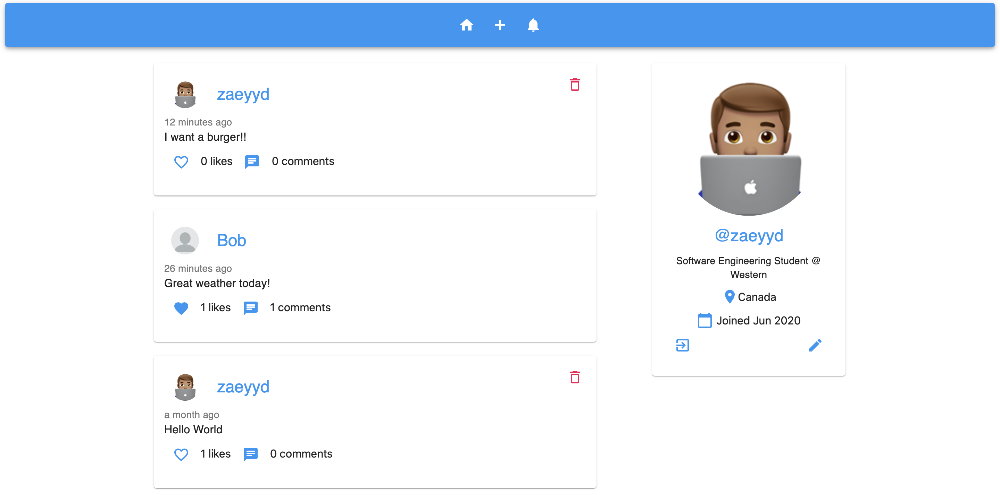
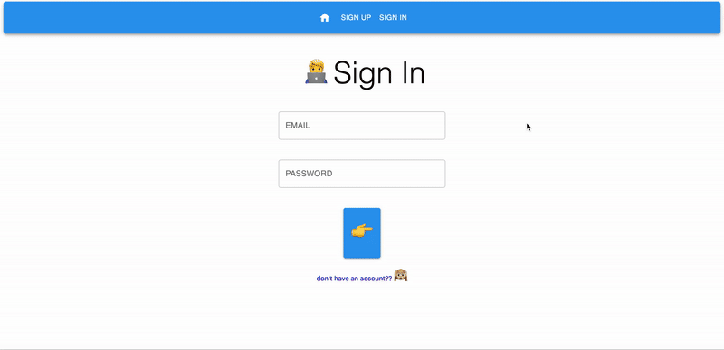

# SocialApp
Full Social Networking Application built with React and Firebase

## [Live Website Link](https://socialapp1265.firebaseapp.com)

### Screenshot of front-page when user is signed in
 

### Gif walkthrough of web app (30 sec)
 

## Features:
- Creating/Deleting Posts
- Creating/Modifying User Profile
- Commenting on Posts
- Liking/Unliking Posts
- Getting Notifications

## Technologies Used
### Languages:
  - JavaScript
  - HTML
  - CSS
### Front-end:
  - React
  - Redux
  - Material-ui
### Back-end:
  - Firebase
    - Authentication
    - Firestore (No-SQL Database)
    - Functions
  - ExpressJS
  - NodeJS
### Tools:
  - Git
  - Postman
 

